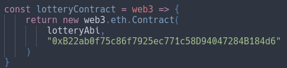

# Lottery

## Description
This repo includes the frontend of the application, which can be used to bet ethereum within a lottery simulation. Everything is compiled and run  within a testnet, in this case Rinkeby. Truffle was used to deploy the smart-contract, to find the configuration follow the next link: [Lottery-Truffle](https://github.com/ReyVega/Lottery-Truffle)

## Technologies used
1. Next.js - Framework used for frontend
2. TypeScript - Programming Language fo frontend
3. Web3.js - Library to manage transactions among betters wihtin Next.js
4. MetaMask - Virtual wallet to hold cryptocurrency
5. Infura - API which connects projects to the Ethereum Blockchain
6. Solidity - Programming Language for smart-contracts
7. Truffle - Framework for deploying smart-contracts

## Main page structure
[index.tsx](https://github.com/ReyVega/Lottery/blob/main/pages/index.tsx)

## Important things to take into consideration
1. Change smart-contract's address with yours within ./blockchain/lottery.js



2. Besides installing dependencies, compile the project with the following command:

```
npm run compile
```
